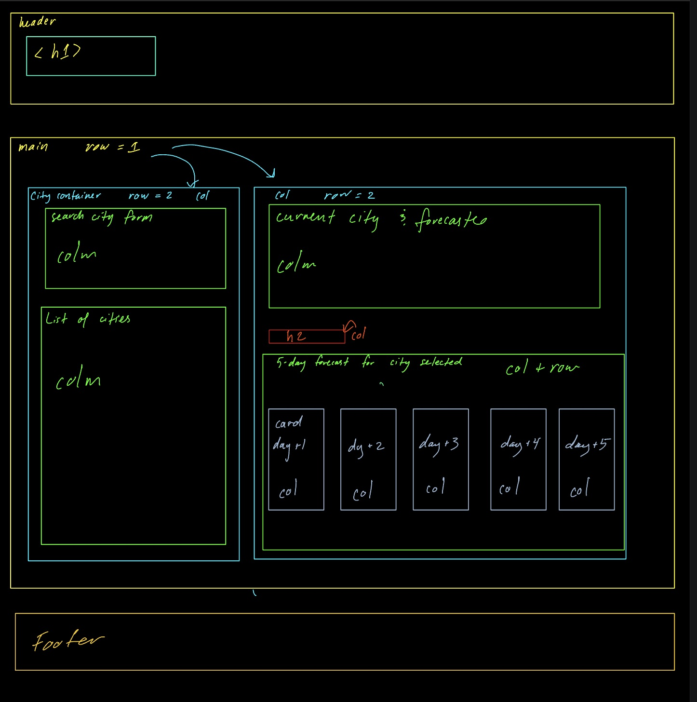
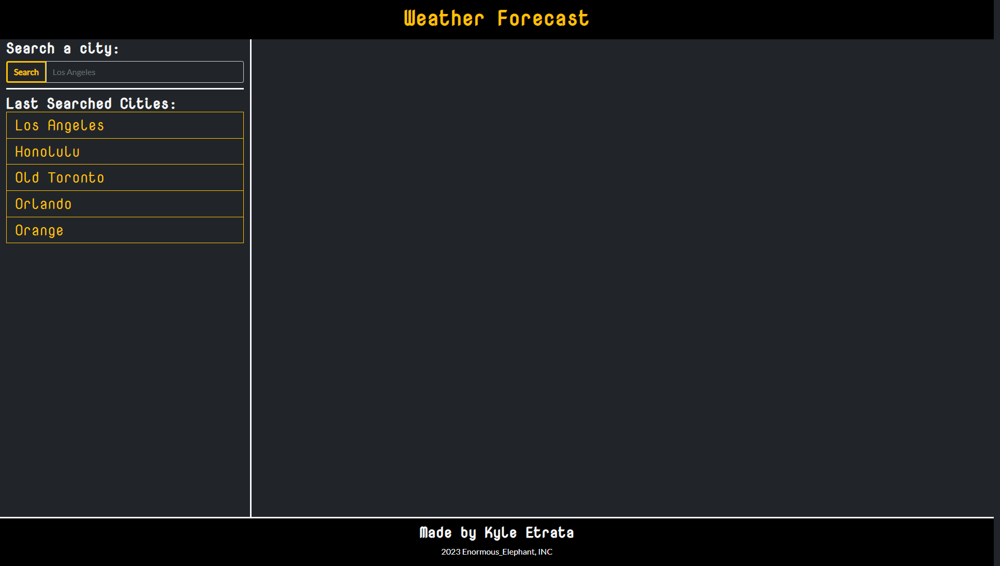
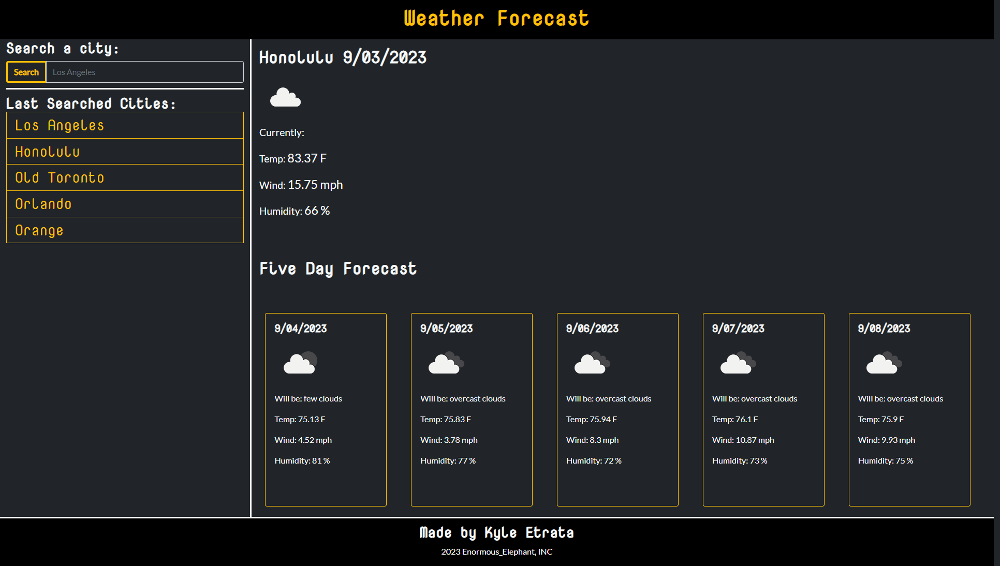

# 06-Weather-App-Challenge-6
5 day weather forecast app

## Description

This project was to build a weather application with the goal of allowing a user to look at a city and see what the current and future weather will be like. The usefulness of this application are for those who are traveling and are trying to pack and plan accordingly or for the curious who just want to know what the weather is like in a distant city. The challenges faced in this project was how to properly use a new (to me) API and how to get it to yield the data useful to me. In this project, that new API was from [OpenWeather](https://openweathermap.org/). OpenWeather's documentation on their API helped me figure out how to make the call to the site and what type of data it would yield back to me. From there it was a matter of sifting and navigating the data through JavaScript to dynamically display it to the index.HTML. Another issue encoutered with this project was hunting down and fixing bugs. While writing the JavaScript, I encountered numerous bugs that wouldn't crash the application, but rather stop certain sections of the app from displaying the data called from OpenWeather. Solving these bugs, took a tremendous amount of trial and error and helped me further myself as a developer of how to spot potential errors, before getting to the testing phase of the application. Moving forward, I plan to implement these practices for catching errors, nulls, etc. into all of my future code.

A link to the deployed application can be found [here](https://kyleochata.github.io/06-Weather-App-Challenge-6/)

Screenshots of Project:

Wireframe: 

Page on Load: 

Page after search:

## Installation

Locate a suitable place where you would like to download this repository. Once found, copy the repositories SSH or HTTPS to clone through the terminal or download the zipfile from GitHub. After it is downloaded, right-click the index file and launch with your preferred internet browser.

While in the browser, feel free to examine the HTML and CSS code in developer mode by hitting F12 or right-clicking the screen and navigating to inspect.

## Usage

This repository is allowed for use in a learning environment to evaluate and analyze.

## Credits

Credits are given to the following:

* UCI full-stack coding bootcamp for the acceptance criteria for the project.

* AskBCS and their array of assistants that helped me out with technical questions when they arose.

* Googlefonts for their [fonts](https://fonts.google.com/).

* DayJS for usage of their [API](https://day.js.org/).

* Open Weather for usage of their [API](https://openweathermap.org/).

* Bootstrap for the framework of the [styling](https://getbootstrap.com/).

## License

Please refer to the LICENSE found in the repository.